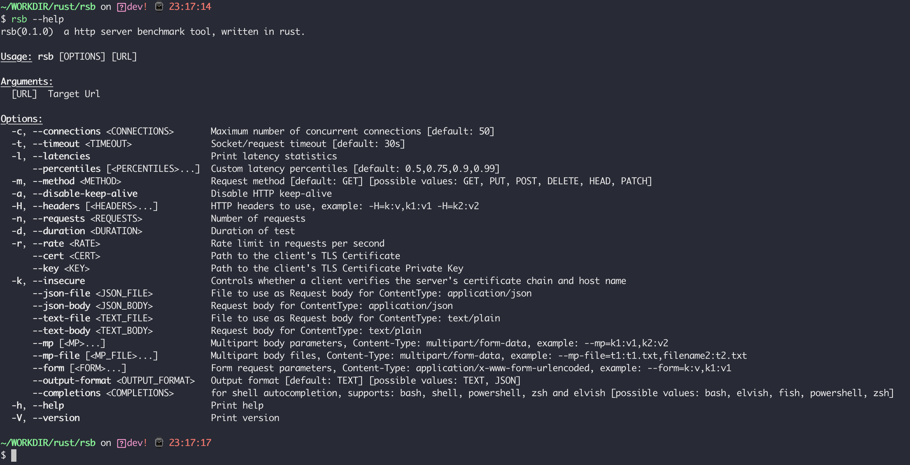

# rsb - rust benchmark

[](https://github.com/gamelife1314/rsb/actions)
[](https://github.com/gamelife1314/rsb/blob/main/LICENSE)
[](https://app.codecov.io/gh/gamelife1314/rsb)

`rsb` is a http server benchmark tool written in rust. The development of this tool is mainly inspired 
by the [`bombardier`](https://github.com/codesenberg/bombardier) project, and I would like to thank the author for his 
contribution. On the other hand, this tool was developed primarily to learn and understand Rust.

## Install

If you are a Rust developer，and you have already installed Rust-related toolchains locally, you can install them 
through Cargo.

    cargo install --git https://github.com/gamelife1314/rsb

Or you can go [Release Page](https://github.com/gamelife1314/rsb/releases) to download the compiled version for the 
corresponding platform.

If you want to use the automatic completion function of the shell, you can output the completion script corresponding 
to the shell through a command similar to the following. `rsb` supports `bash`, `elvish`, `fish`, `powershell`, and `zsh`.
For example:
    
    eval "$(rsb --completions zsh)"

## Usage

First, let's take a look at the overall picture of this tool:



The tool has two modes when running, which must be specified when using it. One is based on the total amount, that is, 
you need to declare how many requests you need to send in total, which can be specified by the `-n` parameter. The other 
is based on the running time, which means how long you need to test, which can be specified by the `-d` parameter, and 
the unit is seconds.

First, let's look at the example of specifying the total amount：


Let's look at another example of specifying the test duration:


During use, we usually encounter too many specified numbers, or the specified test time is too long. When you want to 
cancel in the middle, you can cancel it directly through `ctrl-c`. After the tool receives the signal, it will complete 
the current request. Exit directly and output the current statistics.


## Header

Custom request headers can be specified via the `-H` parameter, example: `-H=k:v,k1:v1`. It should be noted that if 
`Content-Type` is set, but `--json-file`, `--json-body`, `--text-file`, `--text-body`, `--mp`, `--mp-file`, `--form` 
are also set , then it will be overwritten.

## Proxy

The tool core uses [`request`](https://github.com/seanmonstar/reqwest) to send Http requests, so it currently inherits 
its support for proxies. The proxy for HTTP requests can be set through the environment variable `http_proxy`, and the 
proxy for HTTPS requests can be set through the environment variable `https_proxy`. The use of `socks` proxy is also 
    supported. [`Here`](https://docs.rs/reqwest/latest/reqwest/#proxies) are more declarations about proxies.

example:

    export http_proxy=http://127.0.0.1:1087;export https_proxy=http://127.0.0.1:1087;export ALL_PROXY=socks5://127.0.0.1:1080

## TEXT BODY

If you want to set the request body as a text type, you can specify a file as input through `--text-file`, or specify a 
string through `--text-body`. Note that these two parameters can only be selected from one of the two, and cannot 
coexist with other request body setting parameters. when requesting, the content type will be specified as: `text/plain`.

example:

    rsb -n 100 --text-body "anything" http://127.0.0.1:8000/post-text
    // or
    rsb -n 1 -m POST --text-body "chatgpt4.0 is comming and very strong" http://127.0.0.1:54326/post-text

## JSON BODY

If the data type you want to send is JSON, you can specify it with the `--json-body` parameter, or read it from a 
file with `--json-file`. When requesting, the request type will be specified as: `application/json`.

example:

    rsb -n 1 -m POST --json-body '{"version":"v0.1.0","name":"rsb"}' http://127.0.0.1:54326/post-json
    // or
    rsb -n 1 -m POST --json-file json.txt http://127.0.0.1:54326/post-json

## FORM BODY

If you want to send a request of type `application/x-www-form-urlencoded`, you need to pass the `--form` parameter.
This parameter can be specified multiple times, and multiple key-value pairs can be declared each time.

example:
    
    rsb -n 1 -m POST --form=k:v,k1:v1 --form=k2:v2 http://127.0.0.1:54326/post-form

## MULTIPART BODY

If you want to send a request of `multipart/form-data` type, or want to upload a file, you can specify parameters 
through `--mp` and specify the file to be uploaded through `--mp-file`.

example:
    
    rsb -n 1 -m POST --mp-file=f1:LICENSE,rsb:target/debug/rsb.exe --mp=k1:v1 http://127.0.0.1:54326/upload-file

## CLIENT CERTIFICATE

If the server needs to verify the client's certificate, you can pass `--cert` and `--key` to specify the client's 
certificate and key respectively.

example:

    rsb -n 500 -l --cert client.pem --key client-key.pem  https://127.0.0.1:9443/hello

You can refer to the following Go code to generate and start an https server for testing：

```go
...

func main() {
	caCert, _ := ioutil.ReadFile("rootCa.pem")
	caCertPool := x509.NewCertPool()
	caCertPool.AppendCertsFromPEM(caCert)

	tlsConfig := &tls.Config{
		ClientCAs:  caCertPool,
		ClientAuth: tls.RequireAndVerifyClientCert,
	}
	tlsConfig.BuildNameToCertificate()

	server := &http.Server{
		Addr:      ":9443",
		TLSConfig: tlsConfig,
	}

	http.HandleFunc("/hello", hello)
	http.HandleFunc("/headers", headers)

	if err := server.ListenAndServeTLS("server.pem", "server-key.pem"); err != nil {
		fmt.Println(err)
	}
}
```